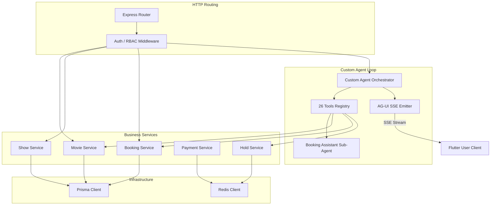
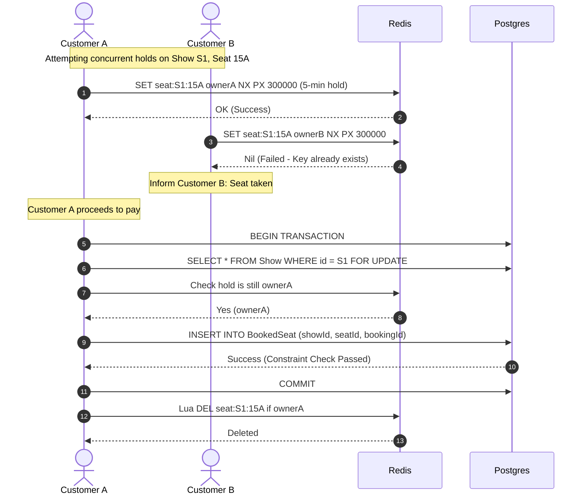

# CineBook Backend Server (`cinebook-server`)

The backend server is built using Node.js 22+, Express, and TypeScript. It uses Prisma ORM (with PostgreSQL) for persistent data storage and Redis for temporary seat holds, sliding window rate limits, and payment circuit-breaker state.

## 1. System Architecture

The server separates standard REST controller endpoints from the custom AI agent runtime. However, both pathways utilize the same underlying service layer to ensure business-rule consistency.



---

## 2. Custom AI Agent Subsystem

The AI chatbot uses a custom loop written on top of the Vercel AI SDK (`ai@7`) communicating with OpenRouter. **No high-level agent frameworks are used.**

### Custom Orchestrator Loop (`src/agent/orchestrator.ts`)
- **Execution Flow**: Low-level orchestration on `streamText`.
- **Context Compaction (`prepareStep`)**: Custom management of dialogue history. It summarizes older tool executions, removes redundant intermediate data, and restricts active tools based on the current conversational phase.
- **Conversation Logs**: Auto-persists system-wide JSON dialogue steps into the PostgreSQL `Conversation` and `Message` tables on completion (`onFinish`).

### The 26 Tools Registry (`src/agent/tools/`)
The orchestrator accesses 26 domain-specific tools, each defined with detailed Zod inputs:
- **Movie (10)**: `searchMovies`, `getMovieDetails`, `getCast`, `getReviews`, `getShowtimes`, `suggestSimilar`, `getTrending`, `getUpcoming`, `listLanguages`, `listGenres`
- **Booking (12)**: `findTheatres`, `getScreenInfo`, `checkSeatAvailability`, `holdSeats`, `releaseSeats`, `createBooking`, `checkBookingStatus`, `cancelBooking`, `viewBookingHistory`, `startPayment`, `confirmPayment`, `applyPromoCode`
- **Profile/Support (4)**: `getProfile`, `updatePreferences`, `getRecommendations`, `contactSupport`

### Sub-agent Delegation ("Booking Assistant") (`src/agent/bookingAgent.ts`)
- Under the main orchestrator, a single tool `delegateToBookingAssistant` acts as a sub-agent.
- It executes a secondary, restricted loop containing only booking-specific tools (`bookingToolsOnly`) with a strict step limit (12 steps).
- Once execution finishes, it returns a structured JSON result (`{ heldSeats, showId, holdExpiresAt, summary }`) back to the parent orchestrator.

### SSE Emitter Protocol (`src/agent/agui-emitter.ts`)
The server converts raw stream parts from the Vercel AI SDK into client-facing AG-UI Server-Sent Events (SSE) at `POST /agent/run`:
- `text-delta` ➔ `TEXT_MESSAGE_CONTENT`
- `tool-call` ➔ `TOOL_CALL_START` (client displays shimmer loader)
- `tool-result` ➔ `TOOL_CALL_RESULT` (payload rendering native visual widgets)
- Context modification ➔ `STATE_SNAPSHOT` / `STATE_DELTA` (JSON patches updating local store)

---

## 3. Concurrency & Seat Locking

To guarantee that two users cannot book the same seat simultaneously, the server implements a high-throughput concurrency mechanism:



### Steps:
1. **Hold (`holdSeats`)**: Uses Redis `SET seat:{showId}:{seatId} {ownerToken} NX PX 300000`. This sets a 5-minute TTL hold. If the key exists, the hold is rejected.
2. **Release (`releaseSeats`)**: Uses a Lua compare-and-delete script. This ensures a user can only release a seat if they own the active hold token.
3. **Confirm (`createBooking`)**:
   - Opens a PostgreSQL transaction.
   - Executes a row-level lock (`SELECT ... FOR UPDATE`) on the `Show` record or relies on DB constraints.
   - Re-checks that the Redis hold keys are still valid and owned by this transaction's user token.
   - Inserts records into `Booking` and `BookedSeat` tables.
   - Releases the Redis holds.
   - Database constraint `@@unique([showId, seatId])` on `BookedSeat` enforces final consistency.

---

## 4. Hall Manager Scheduling Rules

When creating or modifying shows via `ShowService`, the server enforces the following strict rules:
- **No Overlap**: A screen cannot host two shows at the same time.
- **Cleaning Gap**: There must be at least a 30-minute buffer gap between shows on the same screen.
- **Planning Window**: Shows cannot be scheduled more than 30 days in advance.
- **Screen Ownership**: The manager must be assigned to the screen they are scheduling (bypassed by admin overrides).
- **Edit Lock**: A show cannot be modified or deleted if it has at least one confirmed booking (`BookedSeat`).

---

## 5. Resiliency & Cross-Cutting Features

- **Observability**: Logs a unique correlation ID per request (via Node's `AsyncLocalStorage`). Every tool execution outputs execution latency, inputs, and state.
- **Sliding-Window Rate Limiter**: Implemented using Redis sorted sets (zsets) to track client API calls. Limits: chat 30/min/user, bookings 5/hr/user, phone OTP 5/hr/phone.
- **Payment Circuit Breaker**: Wraps the payment gateway. If payment attempts fail N consecutive times, the breaker trips to `OPEN` for a cooldown duration, returning immediate error responses. Breaker states are synchronized in Redis.

## 6. Setup & Commands

Ensure Docker is running, then use the following commands:
```bash
# Install packages
npm install

# Run migrations
npx prisma migrate dev

# Seed database
npm run seed

# Run tests
npm run test

# Start development server
npm run dev
```
