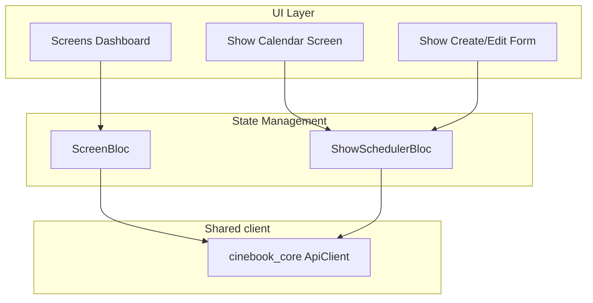
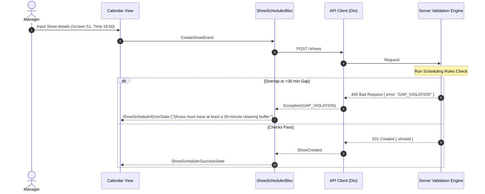

# CineBook Hall Manager App (`cinebook_hall_app`)

This is the manager-facing Flutter application. It allows screen managers to configure theater halls, schedule shows, and view schedules via a calendar interface.

## 1. Application Architecture

The application uses the BLoC pattern to manage screen layout states and calendar mutations.



---

## 2. Scheduling Flow & Business Validation

While the client provides user-friendly validation hints, the **server acts as the single source of truth** for all scheduling rules.



### Server Error Parsing
When the manager attempts to save a show schedule, the backend executes rule checks. If a conflict occurs, the server returns a specific error payload (e.g., code `OVERLAP_CONFLICT` or `GAP_VIOLATION`). The `ShowSchedulerBloc` catches the exception, maps the server code to localized warning messages, and displays them as floating Snackbars or form validation alerts.

---

## 3. Development Setup

1. **Fetch Packages**:
   ```bash
   flutter pub get
   ```
2. **Launch the App**:
   ```bash
   flutter run
   ```
