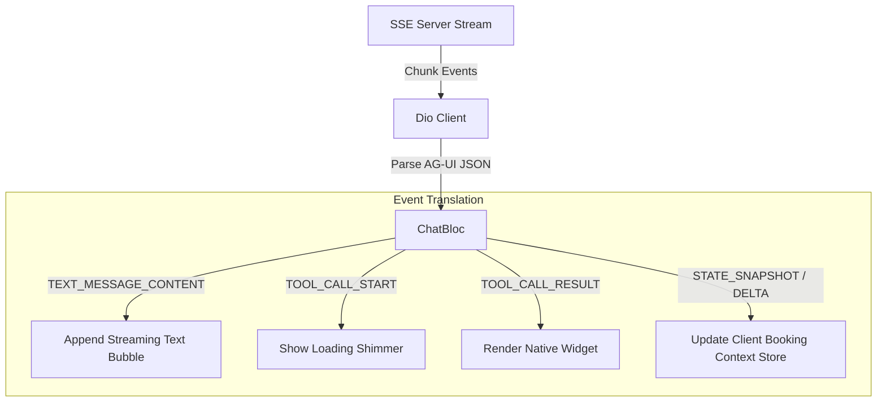

# CineBook Customer App (`cinebook_user_app`)

This is the customer-facing Flutter application. It allows users to browse movies, purchase tickets, view their booking history, and interact with the AI-powered reservation assistant.

## 1. Application Architecture

The application is structured around the BLoC (Business Logic Component) pattern for state management. It separates raw network requests (from `cinebook_core`) from the rendering layer.

```mermaid
graph TD
  subgraph UI Layer
    MoviesList[Movies List Screen]
    MovieDetail[Movie Detail Screen]
    SeatMap[Seat Map Screen]
    ChatAssistant[AI Chat Assistant Screen]
  end

  subgraph State Management (BLoC)
    MovieBloc[MovieBloc]
    SeatMapBloc[SeatMapBloc]
    ChatBloc[ChatBloc]
  end

  subgraph Data Layer
    CoreClient[cinebook_core ApiClient]
    SSEClient[Dio SSE Listener]
  end

  MoviesList --> MovieBloc
  MovieDetail --> MovieBloc
  SeatMap --> SeatMapBloc
  ChatAssistant --> ChatBloc

  MovieBloc --> CoreClient
  SeatMapBloc --> CoreClient
  ChatBloc --> SSEClient
```

---

## 2. Core Functional Flows

### AI Chat Event Processing (SSE to Rich Widgets)
The chatbot uses `flutter_gen_ai_chat_ui` (v2.14.0) to present a clean dialog box.
Since the tools run on the server, the client does not execute actions locally. Instead, the `ChatBloc` processes incoming SSE chunks from the server:



1. **Streaming Output**: Text deltas are appended to active text bubbles word-by-word.
2. **Action Indicator**: On `TOOL_CALL_START`, a visual shimmer is displayed (e.g. "checking availability...").
3. **Rich UI Insertion**: On `TOOL_CALL_RESULT`, the bloc swaps the loading shimmer with a native Flutter widget matching the tool's return type (e.g., rendering a clickable seat layout or movie info card).
4. **Context Synchronization**: Updates from `STATE_SNAPSHOT` or JSON diff patches (`STATE_DELTA`) are stored in the client-side booking context store, updating current selections and price totals.

### Real-Time Seat Map Polling
- When the Seat Map screen is active, `SeatMapBloc` starts a polling timer.
- It calls `GET /shows/:id/seats` every 2-3 seconds to fetch the merged state of PostgreSQL bookings and Redis holds.
- Seat states (Available, Held by Me, Held by Other, Booked) are visually color-coded.
- An overlay displays a 5-minute countdown representing the Redis hold expiration TTL.

---

## 3. Development & Running

1. **Verify Dependencies**: Ensure Flutter is installed and you are within the `cinebook_user_app/` directory.
2. **Fetch Packages**:
   ```bash
   flutter pub get
   ```
3. **Launch the App**:
   ```bash
   flutter run
   ```
